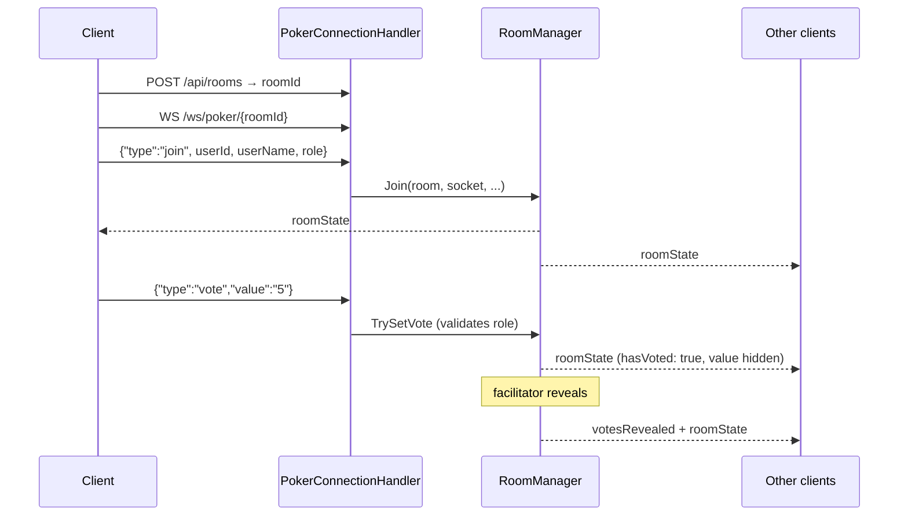

# Poker Planning — Realtime Server

A self-hosted planning poker server for agile estimation sessions: a room, a backlog, a
deck of cards, and everyone's vote revealed at the same instant. Built as an ASP.NET Core
service that speaks **raw WebSockets** — no SignalR, no message broker, no database.

- **Live instance:** <https://poker.programmatoreincamicia.dev>
- **Web client:** [PokerPlanningFrontEnd](https://github.com/ProgrammatoreInCamicia/PokerPlanningFrontEnd) — Angular 22, zoneless, signal-based
- **License:** [PolyForm Noncommercial 1.0.0](LICENSE.md) — free for noncommercial use, commercial use requires a separate license

---

## Why this exists

Every planning poker tool my team tried was either priced per seat for something a sprint
ceremony needs twice a month, or free-but-abandoned with a broken reconnect that dropped
half the room whenever someone's laptop slept. So the requirements were narrow and clear:

1. **Join by link, no account.** A ceremony that starts with fourteen people signing up is
   a ceremony that starts ten minutes late.
2. **Survive a bad network.** Refreshing the page, switching from Wi-Fi to hotspot, or
   closing the lid for two minutes must not lose your seat or your vote.
3. **Survive the facilitator leaving.** The session must not become read-only because one
   person's connection died.
4. **Zero operational surface.** One process, one container, no database to back up.

Those four constraints drive nearly every design decision below.

---

## Features

| | |
|---|---|
| **Rooms** | Created on demand with a readable generated ID (`falco-ardente`), no signup |
| **Decks** | Fibonacci (`0 1 2 3 5 8 13 21 ? ☕`) and T-shirt sizing (`XS…XXL ? ☕`) |
| **Roles** | Facilitator (drives the session, does not vote) and voters |
| **Backlog** | Add tasks inline, or import a CSV with column mapping; export results back to CSV |
| **Voting** | Hidden votes with a live "3 of 6 voted" counter, simultaneous reveal, final estimate confirmed per task |
| **Resilience** | 20-minute reconnect grace period; the facilitator role is auto-handed over after 2 minutes of absence |
| **Moderation** | Lock the room to newcomers, kick a participant, hand over the facilitator role |
| **Breaks** | Server-authoritative break timer, so everyone's countdown agrees |
| **Levity** | Throw an emoji at a colleague who estimated 21 |

---

## Architecture

```
PokerPlanning.Api/
├─ Program.cs                        DI, CORS, and the single WebSocket endpoint
├─ Controllers/
│  └─ RoomController.cs              HTTP side: create room, exists, CSV import/export
├─ WebSockets/
│  ├─ PokerConnectionHandler.cs      Per-connection receive loop + message dispatch
│  ├─ RoomManager.cs                 All session state and every state transition
│  ├─ RoomCleanupService.cs          Background sweep: stale participants, dead rooms
│  ├─ Messages/                      Incoming message shape, card presets
│  └─ Models/                        Room, Participant, PokerTask
└─ Utilities/
   └─ CsvHelper.cs                   Delimiter sniffing and column-name heuristics
```

The whole system is three moving parts:



`PokerConnectionHandler` never touches state directly and `RoomManager` never reads the
socket: the handler parses and validates the envelope, the manager owns every transition
and every broadcast. That split is what keeps a 350-line dispatcher and a 550-line state
machine from turning into one 900-line file.

---

## Architectural decisions

### Raw WebSockets instead of SignalR

SignalR would have given hubs, groups, automatic reconnect, and transport fallback for
free. It was deliberately not used, for two reasons.

The honest one: this project started as an exercise in understanding what WebSockets
actually *are* — the upgrade handshake, framing, keep-alives, the difference between a
clean close and a dropped TCP connection. SignalR abstracts exactly the layer I wanted to
see.

The one that survived the exercise: the protocol here is tiny and completely
server-authoritative — one message shape in, one state snapshot out. Hubs and groups
would have been ceremony around a `ConcurrentDictionary`, and the SignalR client would
have added a nontrivial dependency to a frontend that otherwise ships only Angular. The
reconnect logic SignalR provides is ~40 lines of exponential backoff on the client, which
is written and readable in `WebsocketService`.

The cost is real and worth naming: no transport fallback for networks that block
WebSocket upgrades, and no built-in scale-out backplane. Both are acceptable for the
target — a team of ten on a corporate VPN — and both are the first things that would have
to change to scale past one instance.

### In-memory state, no database

There is no persistence layer. Rooms live in a `ConcurrentDictionary<string, Room>` inside
a singleton, and a room that stays empty for five hours is garbage collected.

This is the right trade for the domain, not laziness. A planning poker session is
inherently ephemeral: the artifact worth keeping is the final estimate, and that leaves
via CSV export at the end of the ceremony. Adding Postgres would mean a migration story,
a backup story, and a connection pool — for data whose useful lifetime is ninety minutes.

The consequence, stated plainly: **a deploy or a process restart ends every live session.**
For a tool used twice a sprint, restarting outside ceremony hours is a scheduling problem,
not an engineering one.

### Full state snapshots, not deltas

Every mutation broadcasts the *entire* room state to every connected client, rather than a
targeted patch. A room is a couple of dozen participants and a backlog of maybe fifty
tasks — a few kilobytes of JSON, on events that happen a few times a minute.

Deltas would save bandwidth nobody is short of and buy a class of bug nobody wants: a
client whose local state has silently diverged from the server's. With snapshots, a
reconnecting client is automatically correct after one message, and the frontend store
reduces to "replace everything with what the server just said". The reconnect path needed
no special casing at all, which is the real payoff.

### Disconnection is not departure

A closed socket does **not** remove a participant. `HandleSocketClosed` marks them
disconnected with a timestamp and leaves their vote intact; a background sweep evicts them
only after a 20-minute grace period.

This is the decision that makes the tool usable in practice. Page refreshes, laptop lids,
and VPN reconnects are the normal case in a remote ceremony, not the exception. Identity
is a client-generated `userId` held in session storage, so a returning socket reclaims the
same seat — vote, role, and all.

The subtle part is the race: a fast reconnect can install a new socket *before* the old
one's close handler runs. The handler therefore only marks the participant as gone if the
socket that closed is still the one currently registered:

```csharp
if (participant.Socket == socket)
{
    participant.Socket = null;
    participant.DisconnectedAt = DateTime.UtcNow;
}
```

Without that guard, a refresh would eject the user who just came back.

### The facilitator role is recoverable, not sacred

Only the facilitator can reveal, reset, select a task, or moderate. That makes them a
single point of failure — so after **2 minutes** of facilitator absence the cleanup
service promotes the longest-present connected voter automatically. The facilitator can
also hand the role over deliberately.

Two minutes is a deliberately awkward number: long enough that a page refresh does not
trigger a handover, short enough that a room is never stuck for a whole coffee break.

### Server-authoritative break timer

Breaks are stored as an absolute UTC instant (`BreakEndsAt`) and broadcast as ISO 8601,
not as a "10 minutes remaining" countdown. Clients render the remaining time from that
instant, so a participant who joins mid-break sees the correct countdown and nobody's
clock drift makes the break end at a different time for different people.

### Concurrency model

Participant state lives in `ConcurrentDictionary` and needs no explicit locking. The
backlog is the exception: task *order* is meaningful, so `Room.Tasks` is a `List<T>`, for
which no concurrent equivalent exists. Every read and write of that list is guarded by
`Room.TasksLock`, and broadcasts snapshot it under the lock before serializing — so JSON
serialization can never race a concurrent `AddTask` from another socket.

### Locked rooms remember who belongs

Locking a room shuts out newcomers but must not shut out the person whose train just went
through a tunnel. `Room.KnownUserIds` therefore records every user who has *ever* joined
and is never cleaned up, so a lock check is "has this person been here before?" rather
than "is this person here right now?". Kicks are tracked separately in `KickedUserIds`, and
those win.

---

## Protocol

### Client → server

All frames are JSON objects with a `type` discriminator. Fields not listed are ignored.

| Type | Fields | Who can send |
|---|---|---|
| `join` | `userId`, `userName`, `role` | anyone |
| `vote` | `value` | voters |
| `reveal` | — | facilitator |
| `reset` | — | facilitator |
| `changePreset` | `preset` | facilitator |
| `addTask` | `taskTitle` | facilitator |
| `deleteTask` | `taskId` | facilitator |
| `selectTask` | `taskId` | facilitator |
| `resetTasks` | — | facilitator |
| `confirmEstimate` | `taskId`, `finalEstimate` | facilitator |
| `setRoomLocked` | `locked` | facilitator |
| `kickParticipant` | `targetUserId` | facilitator |
| `promoteToFacilitator` | `targetUserId` | facilitator |
| `startBreak` | `breakMinutes` (1–180) | facilitator |
| `cancelBreak` | — | facilitator |
| `changeUserName` | `userName` | anyone |
| `throwEmoji` | `targetUserId`, `emoji` | anyone |

Authorization is enforced in `RoomManager`, not in the dispatcher — the facilitator check
resolves the socket to a participant and reads their current role, so a promotion or
handover takes effect on the very next message with no client involvement.

**Field limits.** An open socket is a public API, so every text field is capped
server-side (`FieldLimits`) rather than trusting the client's `maxlength`. Without that,
anyone could push a few kilobytes into a display name and have the server rebroadcast it
to the whole room on every subsequent state change.

| Field | Limit |
|---|---|
| `userName` | 40 |
| `taskTitle` | 200 |
| `finalEstimate`, `value` | 16 |
| `emoji` | 32 |
| `userId`, `targetUserId`, `taskId` | 64 |
| CSV metadata values | 500 |

Messages that exceed a limit are **rejected** with an `error` frame — silently truncating
an interactive input is more confusing than saying no. CSV import is the exception and
**truncates** instead: one oversized description in a Jira export should not fail the
other two hundred rows.

### Server → client

| Type | Meaning |
|---|---|
| `roomState` | Full snapshot: preset, revealed flag, active task, backlog, participants, lock state, break end |
| `votesRevealed` | Sent immediately before the `roomState` that carries the revealed values |
| `emojiThrown` | Transient animation event, not part of room state |
| `error` | Human-readable rejection of the last message |
| `kicked` | You were removed; the client stops reconnecting |
| `joinRejected` | Join refused, `reason` is `kicked` or `locked` |

Votes are never sent to other clients before reveal — `roomState` carries only a
`hasVoted` boolean per participant. Hiding cards is a server guarantee, not a UI
convention.

### HTTP API

| Method | Route | Purpose |
|---|---|---|
| `POST` | `/api/rooms` | Create a room, returns the generated `roomId` |
| `GET` | `/api/rooms/{roomId}/exists` | 200 / 404 — lets the client show a clean error instead of retry-looping a WebSocket |
| `POST` | `/api/rooms/{roomId}/previewCsvHeaders` | Sniff delimiter and suggest a column mapping |
| `POST` | `/api/rooms/{roomId}/importTasks` | Import the backlog with a confirmed mapping |
| `GET` | `/api/rooms/{roomId}/exportTasks` | Export tasks with final estimates as UTF-8 CSV |

CSV import is a two-step handshake — preview, then import — because real exports from Jira
and Azure DevOps disagree about delimiters and column names. The server sniffs `,` vs `;`,
suggests a mapping from a list of aliases (`task`/`title`/`titolo`/`nome`, and so on), and
lets the user confirm before anything is created.

---

## Running it

Requires the [.NET 9 SDK](https://dotnet.microsoft.com/download).

```bash
git clone https://github.com/ProgrammatoreInCamicia/PokerPlanning.git
cd PokerPlanning
dotnet run --project PokerPlanning.Api
```

The API listens on `http://localhost:5165` and `https://localhost:7188`, with Swagger at
`/swagger` in Development. Then start the [frontend](https://github.com/ProgrammatoreInCamicia/PokerPlanningFrontEnd)
with `ng serve` — its dev environment already points at `https://localhost:7188`.

Quick check without a browser, using the requests in `PokerPlanning.Api/PokerPlanning.Api.http`:

```bash
curl -X POST http://localhost:5165/api/rooms
# {"roomId":"falco-ardente"}
```

### Configuration

Allowed CORS origins are configuration, not code — `appsettings.json` for production,
`appsettings.Development.json` for local work:

```json
{
  "Cors": {
    "AllowedOrigins": ["https://poker.example.dev"]
  }
}
```

Session timings are compile-time constants in `RoomManager`, since changing them changes
the product's behaviour rather than its deployment:

| Constant | Value | Effect |
|---|---|---|
| `GracePeriod` | 20 min | How long a disconnected participant keeps their seat and vote |
| `FacilitatorAbsenceTimeout` | 2 min | Absence after which the facilitator role is handed over |
| `RoomAbandonTimeout` | 5 h | How long an empty room survives before being collected |
| `RoomCleanupService.Interval` | 30 s | How often the sweep runs |

---

## Known limitations

Named deliberately rather than discovered later:

- **Single instance only.** State is in-process, so horizontal scaling requires either
  sticky sessions plus a shared store, or a backplane. Not needed at current scale.
- **No persistence.** A restart ends every live session; export before you deploy.
- **No authentication.** Anyone with the room link can join. The room ID is the only
  secret, and lock/kick are the only moderation tools. Fine for a team link in a private
  channel, not fine for anything confidential.
- **Vote values are length-capped but not deck-checked.** A crafted client can submit a
  value that is not in the active preset. Harmless today — it renders as a card nobody
  else picked — but validating against `CardPresets` is the obvious tightening.
- **No per-connection rate limiting.** Message frames are bounded in size, not in
  frequency.
- **No automated tests yet.** The state machine in `RoomManager` is the obvious first
  target — grace period expiry, facilitator handover, and role enforcement are all pure
  logic and easy to cover.
- **Role checks are string comparisons** (`"facilitator"` / `"voter"`) rather than an
  enum, which is a refactor waiting to happen.

---

## License

[PolyForm Noncommercial License 1.0.0](LICENSE.md).

Free to read, run, modify, and share for any **noncommercial** purpose — personal use,
study, hobby projects, and use by nonprofits, schools, and public institutions. **Using it
inside a for-profit company, or offering it as a service, requires a commercial license.**
Get in touch if that's you.
